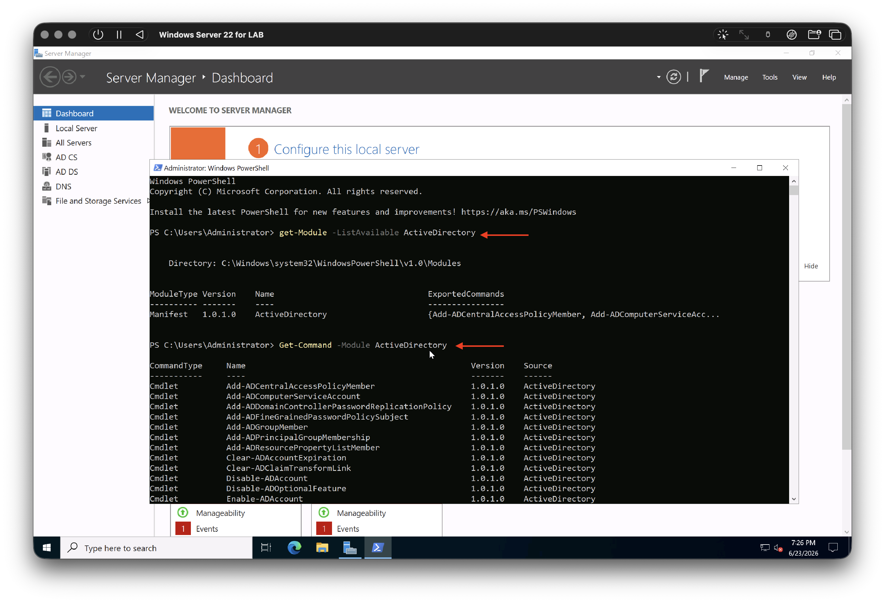
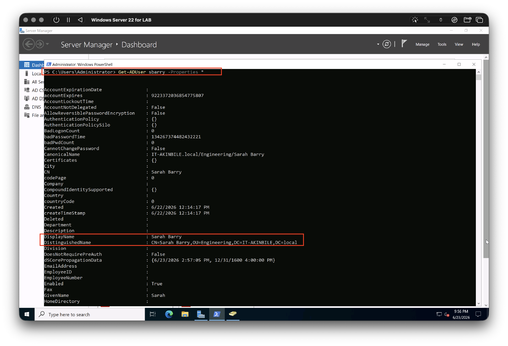
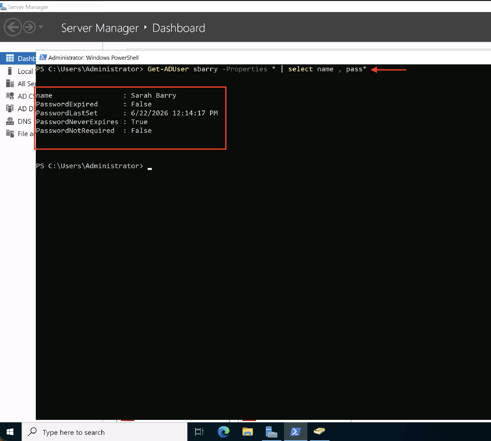
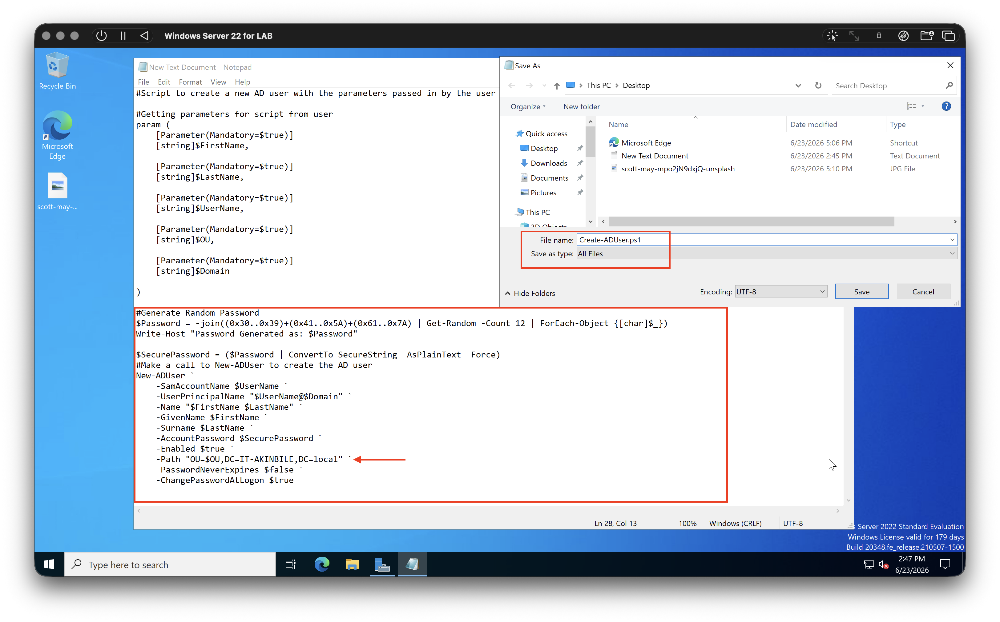
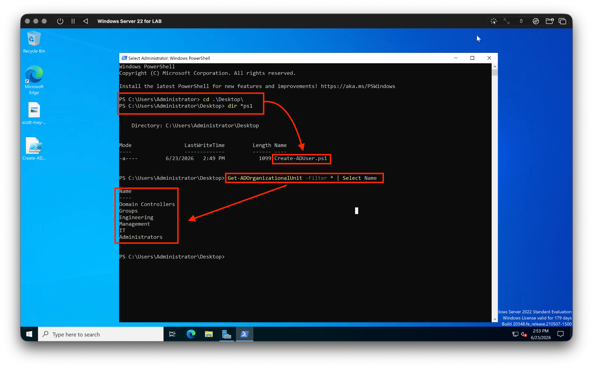
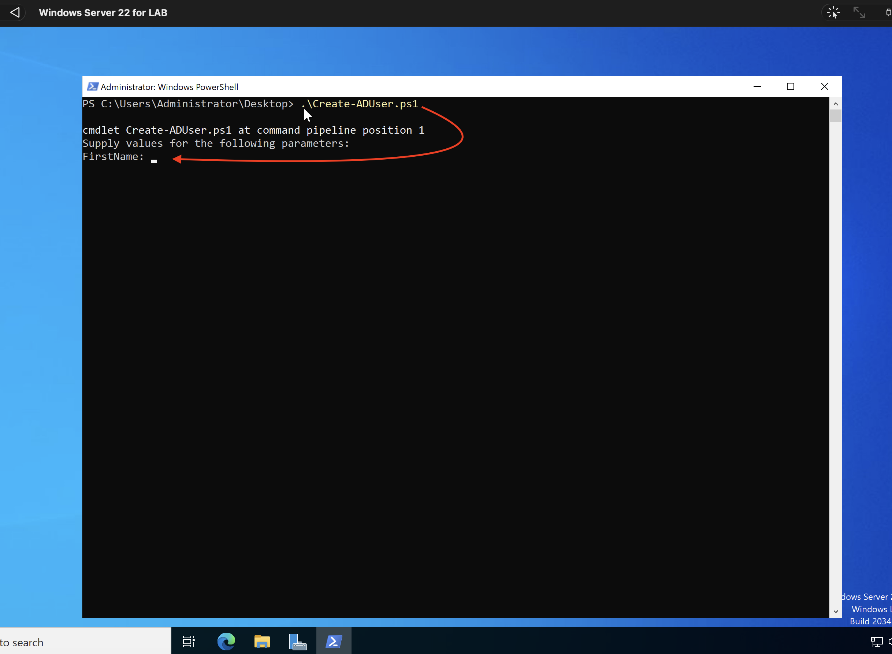
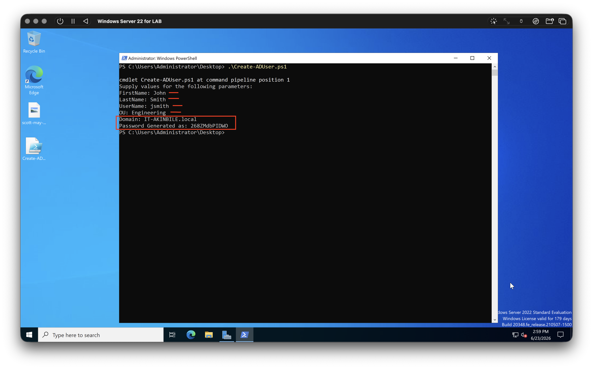
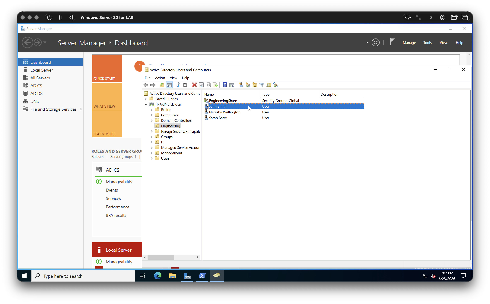

<p align="center">
  
</p>

<p align="center">
PowerShell Automation | Active Directory Administration | User Provisioning | Identity & Access Management | Organizational Unit Management | Password Policy Enforcement | IT Support Automation
</p>

---

# PowerShell Onboarding Automation

---

## Project Overview

This project demonstrates how PowerShell can be used to automate employee onboarding within an Active Directory environment.

The automation provisions new Active Directory user accounts, assigns users to the appropriate Organizational Unit (OU), generates secure passwords, enforces password changes at first logon, and validates successful account creation.

The project was designed to simulate real-world onboarding workflows commonly performed by IT Support Engineers, Service Desk teams, System Administrators, and Identity & Access Management professionals.

---

## Environment

| Component | Technology |
|------------|------------|
| Domain Controller | Windows Server 2022 |
| Directory Service | Active Directory Domain Services |
| Automation Platform | PowerShell |
| User Management | Active Directory |
| Identity Management | Active Directory |
| User Provisioning | PowerShell Automation |

---

## Skills Demonstrated

- PowerShell Scripting
- Active Directory Administration
- User Provisioning
- Identity Management
- Organizational Unit Management
- Password Management
- User Lifecycle Administration
- IT Process Automation

---

## Project Objectives

The objective of this project was to automate the manual process of creating Active Directory user accounts by developing a PowerShell onboarding solution.

The automation was designed to:

- Collect user information through PowerShell parameters
- Generate secure random passwords
- Create Active Directory user accounts
- Assign users to the correct Organizational Unit (OU)
- Enforce password changes at first logon
- Reduce manual administrative effort
- Improve consistency in user provisioning workflows

---

## Project Implementation

1. Active Directory Environment Validation
2. User Information Retrieval
3. Password Policy Verification
4. PowerShell Script Development
5. Script Validation
6. Automated User Provisioning
7. Account Creation
8. Post-Deployment Verification

---


##  Active Directory Environment Validation

Before developing the onboarding automation, I verified that the Active Directory PowerShell module was installed and available on the Domain Controller.

This validation confirmed that the required Active Directory cmdlets were available for user provisioning and directory administration tasks.

### Verification Commands

```powershell
Get-Module -ListAvailable ActiveDirectory

Get-Command -Module ActiveDirectory
```

### Result

The Active Directory module was successfully detected and the available cmdlets were displayed, confirming that the environment was ready for automation development.



---


##  User Information Retrieval

Before developing the onboarding script, existing Active Directory user accounts were reviewed to understand how user objects are structured within the domain.

PowerShell was used to retrieve user properties including usernames, distinguished names, and Organizational Unit (OU) locations.

### Verification Command

```powershell
Get-ADUser -Identity sbarry -Properties *
```

### Result

The command returned detailed Active Directory attributes for an existing user account.

This information was used during script development to ensure that newly created accounts would follow the same naming conventions and Organizational Unit structure used throughout the environment.



---


## Password Policy Verification

Before automating user creation, password-related account settings were reviewed within Active Directory.

This validation ensured that newly provisioned accounts would align with existing account security standards and onboarding requirements.

### Verification Command

```powershell
Get-ADUser -Identity sbarry -Properties PasswordNeverExpires, PasswordLastSet
```

### Result

Password-related attributes were successfully retrieved and reviewed.

Understanding these settings helped ensure that the onboarding automation would create accounts that complied with the organization's password management requirements and first-login security controls.



---


## PowerShell Script Development

After validating the Active Directory environment, a PowerShell onboarding script was developed to automate the user provisioning process.

The script was designed to collect user information, generate a secure password, create a new Active Directory account, assign the user to the correct Organizational Unit (OU), and enforce a password change at first logon.

Automating these tasks helps reduce manual administration, improve consistency, and support repeatable onboarding processes within enterprise environments.

### Development Overview

The script was developed using PowerShell and Active Directory cmdlets to automate common identity management tasks typically performed by IT Support and Systems Administration teams.

### Result

A reusable onboarding solution was created that can provision new Active Directory user accounts through a guided PowerShell workflow.



---


## Script Validation & OU Verification

Before executing the onboarding automation, the script and Active Directory structure were validated to ensure that user accounts would be created in the correct Organizational Units (OUs).

PowerShell was used to verify the presence of the onboarding script and enumerate the available Organizational Units within the domain.

### Verification Commands

```powershell
Get-ADOrganizationalUnit -Filter *
```

### Result

The available Organizational Units were successfully identified and validated.

This step ensured that newly provisioned users could be assigned to the correct department during the onboarding process and reduced the risk of accounts being created in the wrong location.



---


## Automated User Provisioning

After validating the script and Active Directory structure, the onboarding automation was executed.

The script prompts the administrator for user information including first name, last name, username, Organizational Unit, and domain details before automatically provisioning the account.

This approach standardizes the onboarding process and reduces the amount of manual administration required when creating new user accounts.

### Script Execution

The onboarding workflow was launched through PowerShell and guided the administrator through the required user creation inputs.

### Result

The script successfully collected the required information and prepared the user account for automated provisioning within Active Directory.



---

## User Account Creation

The onboarding automation was used to provision a new Active Directory user account within the Engineering department.

User details were supplied through the PowerShell workflow, allowing the script to automatically create the account, generate a secure password, and place the user in the correct Organizational Unit.

### Provisioned User

| Attribute | Value |
|------------|------------|
| First Name | John |
| Last Name | Smith |
| Username | jsmith |
| Department | Engineering |
| Domain | IT-AKINBILE.local |

### Result

The script successfully generated a secure password and created the Active Directory account without requiring manual configuration through Active Directory Users and Computers.

This demonstrates how PowerShell can be used to streamline onboarding workflows and improve consistency across user provisioning tasks.



---


## Account Verification

Following execution of the onboarding automation, Active Directory Users and Computers was used to verify that the newly provisioned account had been successfully created.

The verification process confirmed that the account existed within the correct Organizational Unit and that the onboarding workflow had completed successfully.

### Verification Result

The newly created user account was successfully provisioned and appeared within the Engineering Organizational Unit.

This validation step confirmed that the PowerShell automation correctly:

- Created the Active Directory account
- Assigned the user to the correct Organizational Unit
- Applied the configured account settings
- Completed the onboarding process successfully



---


## Key Automation Components

The onboarding script was built using several PowerShell components that automate common Active Directory administration tasks.

The following sections highlight the core functionality used during the user provisioning process.

---

### Secure Password Generation

A random password is generated during the onboarding process to provide credentials for newly created users.

```powershell
$Password = -join((0x30..0x39)+(0x41..0x5A)+(0x61..0x7A) |
Get-Random -Count 12 |
ForEach-Object {[char]$_})
```

#### What This Does

- Generates a random 12-character password
- Includes uppercase letters
- Includes lowercase letters
- Includes numbers
- Produces a unique password for each user

---

### Secure Password Conversion

Before being passed to Active Directory, the generated password is converted into a secure string.

```powershell
$SecurePassword = ($Password | ConvertTo-SecureString -AsPlainText -Force)
```

#### What This Does

- Converts the password into a format accepted by Active Directory
- Prevents the account from being created using plain text credentials
- Supports secure account provisioning

---

### Active Directory User Creation

The script uses the New-ADUser cmdlet to automate account creation.

```powershell
New-ADUser `
-SamAccountName $UserName `
-UserPrincipalName "$UserName@$Domain"
```

#### What This Does

- Creates a new Active Directory account
- Assigns a username
- Creates a User Principal Name (UPN)
- Automates the account creation process

---

### Organizational Unit Assignment

The onboarding script automatically places newly provisioned users into the appropriate Organizational Unit (OU) based on the value supplied during execution.

```powershell
-Path "OU=$OU,DC=IT-AKINBILE,DC=local"
```

#### What This Does

- Assigns users to the selected department
- Supports structured Active Directory administration
- Reduces manual account management tasks
- Ensures users are provisioned within the correct Organizational Unit
- Supports scalable identity management practices

---


### First Logon Password Change

```powershell
-ChangePasswordAtLogon $true
```

#### What This Does

- Forces users to create a new password during first sign-in
- Improves account security
- Ensures only the user knows their final password
- Aligns with common enterprise onboarding practices


---

## Business Value

This project demonstrates how repetitive onboarding tasks can be automated using PowerShell and Active Directory.

By automating user provisioning, organizations can reduce manual administrative effort, improve consistency, minimize human error, and enforce standard security practices during employee onboarding.

The solution follows enterprise identity management principles by automatically creating accounts, assigning users to the correct Organizational Unit, generating secure passwords, and enforcing password changes at first logon.

---

## Project Outcome

A PowerShell-based onboarding automation solution was successfully developed and tested within a Windows Server 2022 Active Directory environment.

The automation successfully:

- Generated secure passwords
- Created Active Directory user accounts
- Assigned users to Organizational Units
- Applied account security settings
- Enforced password changes at first logon
- Verified successful account creation within Active Directory

---

